# Einleitung

In dieser Dokumentation wird spezifiziert, wie Sie ihre Deep Learning Projekte mithilfe einer `config.dl.yaml` erfolgreich beschreiben.

# Aufbau des Projekts

> Ihr Projekt muss folgende Ordnerstruktur besitzen:

```
Name                  Typ     Beschreibung
----                  ---     ---
src                   Ordner  Ihre Projektdaten zum Ausführen des Projekts
models                Ordner  Ordner mit ihrem Model
etc                   Ordner  [optional] Sonstige Dateien, welche nicht zum Ausführen benötigt werden (z.B. Trainingsskript, Jupyter Notebook)
assets                Ordner  [optional] Bilder/Dateien zur Dokumentation
.gitignore            Datei   .gitignore
config.dl.yaml        Datei   Beschreibungsdatei ihres Projekts
docker-compose.yml    Datei   docker-compose
Dockerfile            Datei   [optional] Dockerfile
LICENSE               Datei   [optional] Lizenz ihres Projekts
README.md             Datei   Projektbeschreibung
```

Wenn Sie ihr Projekt erstellen muss dieses der Vorgegebenen Ordnerstruktur entsprechen.

Optionale Elemente müssen bei der Abgabe nicht in ihrem Projekt vorhanden sein, sind aber "nice to have".
Weitere Elemente, welche nicht von "optional" abgedeckt sind, können ebenfalls in ihrem Hauptverzeichnis vorhanden sein.
Alle Elemente, welche im gezeigten Beispiel nicht mit "optional" gekennzeichnet sind, müssen vorhanden sein.

Bitte beachten Sie, dass Sie ihre Modelle speichern (z.B. mittels `model.save('abc')` (tensorflow) `torch.save(model.state_dict(), PATH)` (pytorch)) und anschließend in den Ordner `models` verschieben.
Ihr Model wird mittels des [Triton Inference Server](https://developer.nvidia.com/nvidia-triton-inference-server) ausgeliefert und dieser liest alle Dateien in diesem Ordner ein.
Bitte legen Sie zusätzlich in ihrem Modelordner noch eine Datei `config.pbtxt` an.
Der Inhalt wird anhand der [Model Configuration](https://github.com/triton-inference-server/server/blob/2af3ab977c31e152881e39127906447700ad1a2b/docs/model_configuration.md) beschrieben.

Bitte beachten Sie vor allem, dass wenn Sie eine Lizenz angeben, diese auch vereinbar ist mit der Lizenz von eventuellen ursprünglichen Werken.
Dies bedeutet, sofern ihr Werk auf der Arbeit eines anderen Projektes aufbaut und dieses Projekt beispielsweise unter der GPL-Lizenz steht, so muss
ihr Werk ebenfalls unter einer der GPL kompatiblen Lizenz stehen.

## `models`-Ordner

```
Datei                     Beschreibung
---                       ---
models                    Ordner mit allen Modellen
  model_name              Ordner Name des Modells. Für jedes Modell jeweils ein Ordner
    config.pbtxt          Konfiguration nach Model Configuration
    1                     Version des Modells. Wenn verschiedene Iterationen ihres Modells existieren, so können Sie auch verschiedene Ordner anlegen.
      model.savedmodel    Ordner mit ihrem gespeicherten Modell.
```

Eine Ausführliche Beschreibung des `models` Ordner finden Sie auf der Seite [Model Repository](https://github.com/triton-inference-server/server/blob/2af3ab977c31e152881e39127906447700ad1a2b/docs/model_repository.md).

# Einstieg

> config:

```yaml
entryPoint: main
name: Example Project
connection:
  main:
    port: 8085
    path: /image/test/{{input.sliderA}}/
    method: GET
input:
  sliderA:
    type: slider
    label: Seed
    values:
      min: 0
      max: 1
      stepSize: 0.01
output:
  firstRandomNr:
    type: html
    label: "First Random Number"
    format:
      labelValue: "{{cmd.json(root/rnd[0])}}"
```

```json
{
  "entryPoint": "main",
  "name": "Example Project",
  "connection": {
    "main": {
      "port": 8085,
      "path": "/image/test/{{input.sliderA}}/",
      "method": "POST"
    }
  },
  "input": {
    "sliderA": {
      "type": "slider",
      "label": "Seed",
      "values": {
        "min": 0,
        "max": 1,
        "stepSize": 0.01
      }
    }
  },
  "output": {
    "firstRandomNr": {
      "type": "html",
      "label": "First Random Number",
      "format": {
        "labelValue": "{{cmd.json(root/rnd[0])}}"
      }
    }
  }
}
```


Zum Starten müssen sie die Datei `config.dl.yaml` in ihrem Hauptverzeichnis anlegen. Ersetzen Sie den Namen ihres Projektes durch einen aussagekräftigen, menschenlesbaren Titel zur Beschreibung ihres Projektes.
Anschließend müssen Sie die Verbindung, welche verwendet werden soll um ihrem Projekt Daten zu übergeben spezifizieren (Abschnitt `connection:`). Nähere Informationen hierzu finden Sie im Abschnitt [Verbindung](#verbindung).
Am Anfang genügt es den Port, Pfad, sowie die HTTP-Methode auswählen. Wenn Sie gerne einen Input referenzieren wollen, so verwenden Sie hierzu die Syntax `{{input.NAME}}`. Näheres hierzu finden Sie im Abschnitt [Variablen](#variablen).

In diesem Beispiel wird als Input ein Slider verwendet, welcher die Werte 0-1 mit der Schrittweite 0.01 akzeptiert. Das Label wird "Seed" sein.

Die Ausgabe wird der erste Eintrag des Rückgabewertes von "rnd" sein. Näheres hierzu finden Sie im Abschnitt [Ausgabe](#ausgabe).

<aside class="notice">
Wenn Sie JSON zur Beschreibung ihres Projekts verwenden, müssen Sie die Datei <code>config.dl.json</code> nennen
</aside>

> /src/app/views.py

```python
import json
from flask import Flask
app = Flask(__name__)


@app.route('/image/test/<seed>/', methods=['GET'])
def algo_test(seed):
  random.seed(seed)
  text = "Seed: {seed:}\n".format(seed = seed)
  results = [random.random() for i in range(10)]
  return json.dumps({"text": text, "rnd": results})
```

Sofern Sie noch kein REST fähiges Projekt haben (wie dies beispielsweise bei einem Jupyter Notebook der Fall ist), müssen Sie ihr Projekt noch anpassen. Wenn Sie ein Python Projekt haben können Sie hierzu [Flask](https://flask.palletsprojects.com/en/1.1.x/) verwenden.
Im nebenstehenden Beispiel können Sie sehen wie die Hauptdatei eines solchen Projekts aussehen kann. Bitte beachten Sie das der Rückgabewert ihrer Anwendung entweder im JSON Format oder als Bild vorliegen muss. Näheres finden Sie unter [Ausgabe](#ausgabe).

# Struktur

> Die oberste Ebene der Konfigurationsdatei besteht immer aus den folgenden Schlüsseln:

```yaml
entryPoint: ...
name: "Test"
description: "Lorem Ipsum"
authors:
  - "John Doe"
connection: ...
input: ...
output: ...
```

```json
{
  "entryPoint": "...",
  "name": "Test",
  "description": "Lorem Ipsum",
  "authors": [
    "John Doe"
  ],
  "connection": {},
  "input": {},
  "output": {}
}
```
### entryPoint

Der Entry Point beschreibt den ersten Request, welcher zum verschicken der Inputs verwendet werden soll. Dieser Request wird immer nach dem abschicken der Eingabe durchgeführt.

Wenn zum Beispiel im Abschnitt `connection` eine Verbindung mit dem Namen `Test` existiert. So kann als `entryPoint: Test` angegeben werden. 

<aside class="notice">
Sie können als entryPoint nur Namen angeben, welche im Abschnitt <code>connection</code> existieren. Sie können <strong>keine</strong> Elemente anderer Abschnitte referenzieren!
</aside>

### Name

Der Name ist ein für Menschen lesbarer Titel des Projekts. Folgende Liste zeigt einige gute und schlechte Beispiele für einen Titel auf:

| Ok  | Name                                | Erklärung                                                                                                                      |
| --- | ----------------------------------- | ------------------------------------------------------------------------------------------------------------------------------ |
| ❌   | StudPro-2020WS-T01-Objekterkennung  | Bitte nicht die Teambezeichnung als Name wählen                                                                                |
| ❌   | CNN/RNN Objekterkennung Zun et. al. | Bitte keine Erklärung zum zugrundeliegenden Algorithmus oder Autor verwenden. Verwenden Sie hierzu "author" oder "description" |
| ❌   | Obj                                 | Funktionsweise nicht erkennbar                                                                                                 |
| ✔️   | Objekterkennung                     |                                                                                                                                |

### Description

> Mehrzeilige Beschreibung

```yaml
description: |
  ### Heading

  * Bullet
  * Points
```

```json
{
  "description": "### Heading\n\n* Bullet\n* Points\n"
}
```


Die Beschreibung kann alle Informationen beinhalten, welche nicht direkt im Titel enthalten sind, so können unter anderem genaue Algorithmen, Funktionsweise, Zitate und ähnliches verwendet werden. Die Beschreibung unterstützt zudem Markdown zur Formatierung.

Sofern Sie bereits eine ausführliche README haben, muss die Description nicht sehr ausführlich sein, sondern es genügt ein Verweis auf die README. Verwenden Sie hierzu die Schreibweise `description: {{include.README.md}}`.

<aside class="warning">Binden Sie bitte keine externen Bilder, große Tabellen oder ähnliche größere Elemente, welche die Formatierung zerstören können ein. Versuchen Sie, wenn möglich nur wichtige Inhalte hervorzuheben, sofern Sie Markdown Befehle verwenden.</aside>

### Authors

```yaml
authors:
  - "John Doe"
  - "Max Mustermann"
  - "Erika Musterfrau, M. Sc."
```

```json
{
  "authors": [
    "John Doe",
    "Max Mustermann",
    "Erika Mustermann, M. Sc."
  ]
}
```

In "Authors" können die Autoren des Projekts genannt werden. Hierbei sollten nur die Namen der beteiligten Studenten verwendet werden. Für die Nennung von Teilnehmer zugrundeliegender Paper verwenden Sie bitte die Beschreibung (`description`).

Die Autoren sind eine Liste von Strings, womit es möglich ist auch mehrere Teilnehmer inkl. Titel/akademische Grade/... (sofern gewünscht) anzugeben.

# Verbindung

```yaml
connection:
  main:
    ...
  imageConnection:
    ...
  pizzaConnection:
    ...
```

```json
{
  "connection": {
    "main": {},
    "imageConnection": {},
    "pizzaConnection": {}
  }
}
```

Der Eintrag "connection" beschreibt alle möglichen Verbindungen zu Ihrem Service. Da die Möglichkeit besteht mehrere Verbindungen zu besitzen
(Dies kann der Fall sein, wenn z.B. eine Verbindung für das Netzwerk existiert und eine weitere um Daten, wie bspw. Bilder, zu laden), müssen diese benannt werden. 

Diese Benennung kann in dem nebenstehenden Beispiel betrachtet werden.
Hierbei werden drei Verbindungen mit den Namen `main`, `imageConnection` und `pizzaConnection` erstellt. Jede dieser Verbindungen kann auch als Wert für `entryPoint` verwendet werden.


## Port, Path und Method

> GET http://hostname:8085/image/test/{{input.algo}}/

```yaml
connection:
  main:
    port: 8085
    path: "/image/test/{{input.algo}}/"
    method: "GET" # POST, PUT, DELETE...
```

```json
{
  "connection": {
    "main": {
      "port": 8085,
      "path": "/image/test/{{input.algo}}/",
      "method": "GET"
    }
  }
}
```

Port, Path und Method sind die minimalen Angaben für eine funktionsfähige Verbindung. Hierbei ist zu beachten, dass der Host nicht angegeben wird. Dieser wird implizit über Docker ermittelt.

<aside class="notice">Wenn Sie eine externe Verbindung zu einem anderen Service (z.B. externer API) benötigen, so können Sie dies innerhalb ihres Services implementieren und die Schnittstelle nach außen weiterreichen</aside>

- **Method** unterstützt folgende Werte: `GET`,`PUT`,`PATCH`,`POST`,`DELETE`,`HEAD`,`COPY`,`OPTIONS`,`LINK`,`UNLINK`,`PURGE`,`LOCK`,`UNLOCK`,`PROPFIND`,`VIEW`
- **Port** unterstützt Zahlenwerte von 1024-65535. Dieser Wert kann frei gewählt werden.
- **Path** kann ein beliebiger Pfad ohne Parameter (/abc/~~**?a=b**~~) sein. Dieser muss mit einem `/` beginnen und enden. Dieser Wert unterstützt Variablen

## Parameter

> http://hostname:8085/abc/**?a=1&b={{input.inputA}}/**

```yaml
connection:
  main:
    # ...
    params:
      a: "1"
      b: "{{input.inputA}}"
```

```json
{
  "connection": {
    "main": {
      "params": {
        "a": "1",
        "b": "{{input.inputA}}"
      }
    }
  }
}
```

Parameter, wie Beispielsweise http://hostname/abc?**a=1&b=2** werden im Feld `params` angegeben. Die Werte von Parametern unterstützen Variablen.

## Header

> Header für `Cookie` und `User-Agent`

```yaml
connection:
  main:
    # ...
    headers:
      Cookie: "SESSION-xyz"
      User-Agent: "Something Special"
```

```json
{
  "connection": {
    "main": {
      "headers": {
        "Cookie": "SESSION-xyz",
        "User-Agent": "Something Special"
      }
    }
  }
}
```

Header können analog zu Parametern angegeben werden mit dem Schlüssel `headers`. Die Werte von Headern unterstützen ebenfalls Variablen.

## Body

> Body vom Typ `binary`

```yaml
connection:
  main:
    # ...
    body:
      type: "binary"
      input: "{{input.abc}}"
```
```json
{
  "connection": {
    "main": {
      "body": {
        "type": "binary",
        "input": "{{input.abc}}"
      }
    }
  }
}
```

> Body vom Typ `raw`

```yaml
connection:
  main:
    # ...
    headers:
      Content-Type: "application/json"
    body:
      type: "raw"
      input: |
        {
          "a:": "{{input.a}}"
        }
```
```json
{
  "connection": {
    "main": {
      "headers": {
        "Content-Type": "application/json"
      },
      "body": {
        "type": "raw",
        "input": "{\n  \"a:\": \"{{input.a}}\"\n}\n"
      }
    }
  }
}
```

> Body vom Typ `form-data`

```yaml
connection:
  main:
    # ...
    body:
      type: "form-data"
      input:
        mainImage:
          type: "file"
          value: "{{input.image}}"
          contentType: "auto"
        testValue:
          type: "text"
          value: "{{input.checkboxA}}"
```
```json
{
  "connection": {
    "main": {
      "body": {
        "type": "form-data",
        "input": {
          "mainImage": {
            "type": "file",
            "value": "{{input.image}}",
            "contentType": "auto"
          },
          "testValue": {
            "type": "text",
            "value": "{{input.checkboxA}}"
          }
        }
      }
    }
  }
}
```

Um Daten im Body zu speichern existieren drei verschiedene Optionen: `form-data`, `binary`, `raw`.

- `binary` wird genutzt um Binärdaten, wie beispielsweise Bilder zu übertragen. Dieser Wert erlaubt nur Variablen als input. Diese müssen zusätzlich in Binärform vorliegen. So kann zum Beispiel `input.abc` im nebenstehenden Beispiel vom Typ `image` sein.
- `raw` wird verwendet um reine Textnachrichten zu übermitteln. Hierbei wird empfohlen über die `headers` Schlüssel noch den Wert `Content-Type` passend zum übertragenen Datentyp anzupassen
- `form-data` erlaubt die Angabe mehrerer Eingabeelemente, welche sowohl Text als auch Dateien beinhalten können. Jedem Wert muss hierbei einen Namen zugewiesen werden. Zusätzlich muss mittels `type` angegeben werden ob eine Datei als Input verwendet wird (`file`) oder es sich um reinen Text handelt (`text`). `file` unterstützt zusätzlich den Wert `contentType` um den Content-Type anzugeben. Die `contentType` Ermittlung kann mittels des Werts `auto` dem Browser überlassen werden.

# Eingabe

Im Abschnitt `input` werden alle Eingabeelemente angegeben, welche zum verwenden des Modells notwendig sind. 

Mögliche Werte für `type` sind:

| Bezeichnung   | Beschreibung                                                                                                                | Beispiel                               |
| ------------- | --------------------------------------------------------------------------------------------------------------------------- | -------------------------------------- |
| `image`       | Eingabeelement ist ein Bild, welches sowohl als Base64 als auch als Binärwert übergeben werden kann                         | 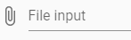      |
| `input`       | Eingabeelement ist ein Freitext-Input. Die Länge, sowie Formatierung kann eingeschränkt werden                              | 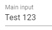       |
| `slider`      | Eingabeelement ist ein Slider, welcher in einem gewissen Bereich mit einer festgelegten Schrittweite Zahlenwerte ausgibt    | 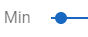      |
| `textarea`    | Eingabeelement ist eine Textarea, welche längeren Freitext erlaubt. Die Länge, sowie Formatierung kann eingeschränkt werden | 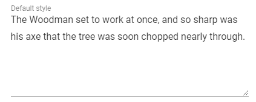    |
| `select`      | Eingabeelement ist ein Select, welches ein Element aus einer (Dropdown-)Auswahl an Elementen erlaubt                        | 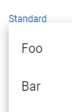      |
| `multiselect` | Eingabeelement ist vom Typ Multiselect, welcher mehrere Element aus einer (Dropdown-)Auswahl an Elementen erlaubt           | 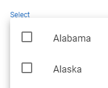 |
| `checkbox`    | Eingabeelement ist vom Typ Checkbox, welches mehrere Element aus einer Auflistung von Elementen erlaubt                     | 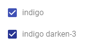    |
| `radio`       | Eingabeelement ist vom Typ Radio, welches ein Element aus einer Auflistung von Elementen erlaubt                            | 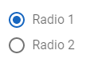       |

```yaml
input:
  imageA:
    label: "Image A"
    type: "image"
    values:
      # ...
```
Der Aufbau eines Eingabeelements folgt immer dem Schema der Nachfolgenden Tabelle:

| Schlüssel | Beschreibung                                    | Mögliche Werte                |
| --------- | ----------------------------------------------- | ----------------------------- |
| label     | Menschenlesbare Bezeichnung des Eingabeelements | Referenzbild, Bild A, Bumpmap |
| type      | Typ des Eingabeelements                         | siehe [Tabelle](#eingabe)     |
| values    | Parameter zur Konfiguration des Eingabeelements | divers                        |

## Image

> Beispiel für ein Bild-Eingabeelement

```yaml
input:
  imageA:
    label: "Image A"
    type: "image"
    values:
      accepts:
        - "image/jpg"
        - "image/png"
      type: "base64"
```

Um ein Eingabeelement, welches Bild akzeptiert zu erstellen muss als Typ `image` angegeben werden. Hierbei können verschiedene Einschränkungen angegeben werden, wie in der Nachfolgenden Tabelle gesehen werden kann:

| Schlüssel | Beschreibung                                                         | Mögliche Werte                | Pflicht |
| --------- | -------------------------------------------------------------------- | ----------------------------- | ------- |
| accepts   | Liste akzeptierter MIME-Types. Muss **immer** `image/jpg` beinhalten | `image/jpg`, `image/png`, ... | ❌       |
| type      | Übergabewert der Datei                                               | `binary`, `base64`            | ✔️       |

### Rückgabewert

Wenn `type` als `base64` definiert ist:

- `data:image/jpeg;base64,/9j/4AAQSkZJRgABAQA...`

Wenn `type` als `binary` definiert ist:

- [binary blob]

## Input, Textarea

```yaml
input:
  inputA:
    label: "Name"
    type: "input"
    values:
      regex: "[A-Za-z0-9]+"
      length:
        min: 100
        max: 5000
```

| Schlüssel | Beschreibung                                             | Mögliche Werte              | Pflicht |
| --------- | -------------------------------------------------------- | --------------------------- | ------- |
| regex     | Regex zur Beschreibung möglicher Werte                   | `[A-Z]+`, `\s?(.*?)`        | ❌       |
| length    | Länge der Eingabe. Wird mittels max und min spezifiziert | `min: 10` <br />  `max: 20` | ❌       |

### Rückgabewert

- UTF-8 Text
- **Beispiele:**
  - `Test ABC`
  - `John Doe`
  - `😎😎`

## Slider

```yaml
input:
  sliderA:
    label: "Bias"
    type: "slider"
    values:
      min: 0
      max: 100
      stepSize: 0.1
```

| Schlüssel | Beschreibung                             | Mögliche Werte       | Pflicht |
| --------- | ---------------------------------------- | -------------------- | ------- |
| min       | Minimalwert, muss kleiner als `max` sein | `10`, `0.01`, `-20`  | ❌       |
| max       | Maximalwert, muss größer `min` sein      | `10000`, `1`, `0.5`  | ❌       |
| stepSize  | Schrittgröße, muss größer 0 sein         | `1`, `100`, `0.0001` | ❌       |

### Rückgabewert

- `numeric` im definierten Zahlenraum. Wenn stepSize < 1 ist, so ist der Rückgabewert ein `float`
- **Beispiele:**
  - `0.01`
  - `100`
  - `-204.2`

## Select, Radio

```yaml
input:
  checkboxA:
    label: "Creator"
    type: "checkbox"
    values:
      - "Dude A"
      - "Dude B"
      - "Dude C"
```

| Schlüssel | Beschreibung                    | Mögliche Werte             | Pflicht |
| --------- | ------------------------------- | -------------------------- | ------- |
| -         | Liste an Auswählbaren Elementen | - `Test A`<br />- `Test B` | ✔️       |

### Rückgabewert

- Element von `values`
- **Beispiele:**
  - `Test A`
  - `Test B`

## Multiselect, Checkbox

```yaml
input:
  checkboxA:
    label: "Creator"
    type: "multiselect"
    values:
      - "Dude A"
      - "Dude B"
      - "Dude C"
```

| Schlüssel | Beschreibung                    | Mögliche Werte             | Pflicht |
| --------- | ------------------------------- | -------------------------- | ------- |
| -         | Liste an Auswählbaren Elementen | - `Test A`<br />- `Test B` | ✔️       |

### Rückgabewert

- Mehrere Elemente von `values`
- Wird als JSON Array formatiert
- **Beispiele:**
  - `["Test A"]`
  - `["Test A", "Test B"]`

# Ausgabe

```yaml
output:
  description:
    label: "List of all Elements"
    type: "list"
```

Alle Ausgabeelemente besitzen mindestens die Elemente `label` und `type`.
`label` wird dazu verwendet um das Ausgabeelement in menschenlesbarer Form zu beschreiben.
`type` unterstützt folgende Werte:

| Bezeichnung | Beschreibung                                                                                                   | Beispiel                            |
| ----------- | -------------------------------------------------------------------------------------------------------------- | ----------------------------------- |
| `html`      | Ausgabeelement ist HTML, welche direkt ausgegeben wird.                                                        | 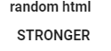    |
| `list`      | Ausgabeelement ist ein eine Liste von Elementen.                                                               | 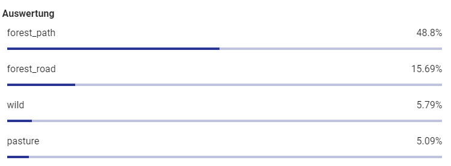    |
| `polygon`   | Ausgabeelement ist ein Polygon, welches dazu verwendet werden kann um Elemente hervorzuheben                   | 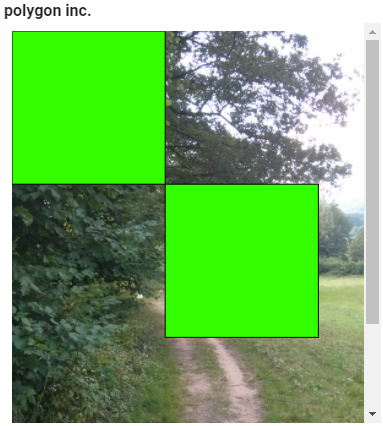 |
| `iframe`    | Ausgabeelement ist ein IFrame, welches externen Inhalt einbinden kann.                                         | 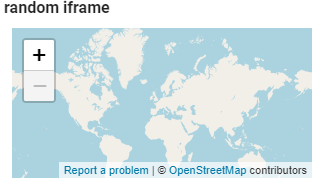  |
| `image`     | Ausgabeelement ist ein Bild, welches entweder von extern oder durch eine spezifizierte Verbindung geladen wird | 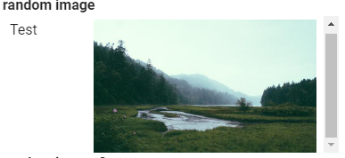   |

## Wiederholung von Ausgabeelementen

```yaml
outputC:
    label: "score output 3"
    type: "list"
    repeat:
      iterator: "connection.main/dense_4/value"
      title: "connection.main/dense_4/title"
    format:
      labelName: "{{cmd.iterator([]/name)}}"
      labelValue: "{{cmd.iterator([]/value)}}"
      representation: "discrete"
```

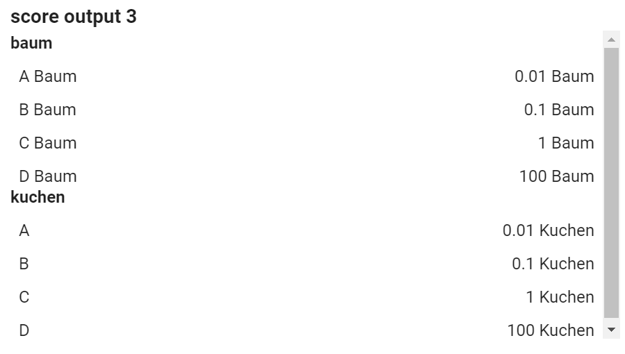

Sie können Mittels des `repeat` Attributs ein Ausgabeelement wiederholen. Hierbei ist zu beachten, dass im `format`-Block Anschließend `cmd.iterator` verwendet werden muss um auf Elemente des Iterators zugreifen zu können.

## HTML

```yaml
outputG:
  label: "random html"
  type: "html"
  format:
    labelValue: "{{cmd.json(connection.main/html[1])}}"
```

Der Typ `html` unterstützt als Eingabe HTML. Mit diesem Typ können komplexere Ausgabewerte abgebildet werden.

<aside class="notice">Bitte binden Sie kein JavaScript oder Form Elemente (input, textarea, etc.) mittels HTML ein!</aside>

## List

```yaml
output:
  description:
    label: "List of all Elements"
    type: "list"
    format:
      labelName: "{{cmd.json(root/dense_2[]/name)}}"
      labelValue: "{{cmd.json(root/dense_2[]/certainty)}}"
      representation: "percentageBar"
    link:
      with: "outputE"

```

List unterstützt folgende Werte für `representation`:

| Bezeichnung     | Beschreibung                                                                                                 | Beispiel                                  |
| --------------- | ------------------------------------------------------------------------------------------------------------ | ----------------------------------------- |
| `discrete`      | Einzelne Werte können als String in `labelValue` angegeben werden.                                           | 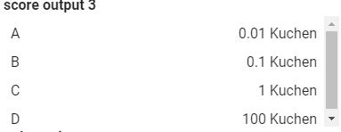      |
| `percentageBar` | Numerische Werte können in Prozent angegeben werden und besitzen zusätzliche eine Leiste zur Visualisierung. | 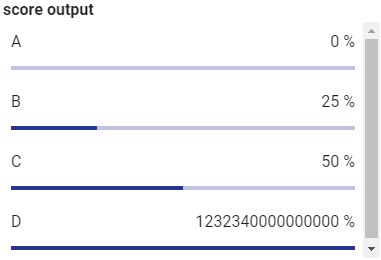 |
| `text`          | Ausgabeelemente sind nur Text und ohne Werte. Der Text wird durch `labelName`  spezifiziert.                 | 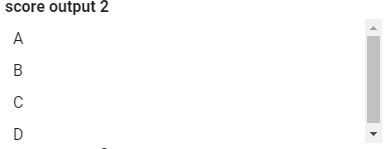          |

`labelName` und `labelValue` können ein Array sein.

Eine Liste kann mittels `link` zu einem Polygon verbunden werden. Hierbei wird mittels des `with`-Attributes der Output angegeben mit welchem die Verknüpfung durchgeführt werden soll.
Aktuell ist dies nur möglich, sofern das Verknüpfte Element vom Typ `polygon` ist.
Die Verknüpfung erfolgt über die Werte, welche in `labelName` stehen. Aus diesem Grund muss sowohl in der Liste als auch im Verknüpften Element die selbe Anzahl an Elementen in `labelValue` vorhanden sein.

## Polygon

```yaml
outputD:
  label: "polygon inc."
  type: "polygon"
  format:
    labelValue: "{{cmd.json(connection.main/polygons[]/coordinates)}}"
    labelName: "{{cmd.json(connection.main/polygons[]/label)}}"
    labelColor: "{{cmd.json(connection.main/polygons[]/color)}}"
    labelLineWidth: "{{cmd.json(connection.main/polygons[]/lineWidth)}}"
    representation: "polygon"
    overlay: "input.image"
    showLabels: true
```

Sofern größere Bilder angezeigt werden sollen, so ist es möglich die Labels, welche auf der rechten Seite angezeigt werden auszublenden mittels `showLabels`. Hierbei wird empfohlen externe Labels, wie im Abschnitt [List](#list) beschrieben, zu aktivieren.

Mittels des Typs `polygon` können Polygone auf einem Overlay (z.B. ein Eingabebild) ausgegeben werden. Polygone werden mittels eines Arrays aus Koordinaten erzeugt. Zusätzlich können noch eine Farbe (HTML Farben, z.B. `#FF0000`/`rgba(255, 0, 0, 0.5)`), sowie ein Label angegeben werden.
Alle Werte können Arrays sein. Bei den Koordinaten kann so ein Array von Arrays angegeben werden um mehrere Polygone auf einem Overlay anzuzeigen.
`overlay` ist eine Verknüpfung zu einem Input (Hierbei wird nicht die übliche `{{}}` Schreibweise benötigt, da dies bereits implizit geschieht).


> JSON Format der Rückgabe

```
"polygons": [
   {
    "coordinates": [
     {
      "x": 0,
      "y": 0
     },
     {
      "x": 1000,
      "y": 0
     },
     {
      "x": 1000,
      "y": 1000
     },
     {
      "x": 0,
      "y": 1000
     }
    ],
    "label": "TEST",
    "color": "#3F0"
   }
]
```

Mögliche Werte für `representation` sind:

| Bezeichnung | Beschreibung                                                                           | Beispiel                                |
| ----------- | -------------------------------------------------------------------------------------- | --------------------------------------- |
| `polygon`   | Polygon erzeugt eine Linie, welche alle Polygone verbindet.                            | 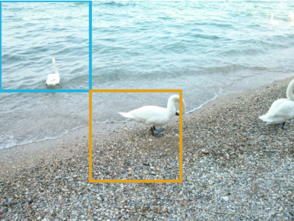 |
| `dots`      | Erzeugt Punkte an der Stelle der Polygone. `labelLineWidth` ist der Radius der Punkte. |     |
| `filled`    | Erzeugt ein gefülltes Polygon.                                                         | 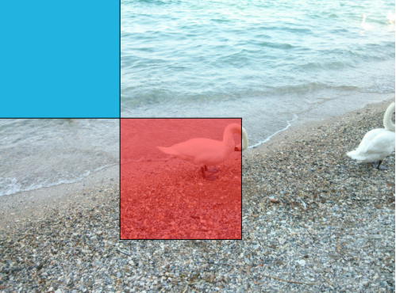  |
## IFrame

```yaml
outputH:
  label: "random iframe"
  type: "iframe"
  format:
    labelValue: "{{cmd.json(connection.main/iframe[0])}}"
```

`iframe` erwartet eine URL zur Anzeige in einem IFrame als `labelValue`. Mit diesem Element können z.B. Karten (OSM) oder sonstige Dienste eingebunden werden.

## Image

> Bildtyp "url"

```yaml
  description:
    label: "random image"
    type: "image"
    format:
      labelName: "test"
      labelValue: "{{connection.main}}"
      type: "url"
```

> Bildtyp "connection"

```yaml
 description:
  label: "random image 2"
    type: "image"
    format:
      type: "connection"
      labelName: "{{cmd.json(connection.imageURL/label)}}"
      connection:
        ref: "imageURL"
        vars:
            id: "{{cmd.json(connection.main/src)}}"
```

Bilder können auf zwei verschiedene Arten eingebunden werden:

| Bezeichnung  | Beschreibung                                                                                             | Beispiel                                                     |
| ------------ | -------------------------------------------------------------------------------------------------------- | ------------------------------------------------------------ |
| `url`        | URL erlaubt es eine Bild-URL (auch Base64 (data:image/jpeg;base64,/9j/4AAQ...) URL möglich) einzubinden. | `{{cmd.json(connection.main/label)}}`, `{{connection.main}}` |
| `connection` | Erlaubt es ein Bild von einer anderen Verbindung nachzuladen                                             | siehe Beispiel                                               |

`url` erlaubt es zusätzlich ein Bild mittels  `{{connection.main}}` anzugeben. Dies erlaubt es Bilder, welche nicht im JSON Format sondern direkt (z.B. mittels `send_file` von Flask) anzugeben.

# Variablen

```yaml
connection:
  main:
    path: "/inputA/{{input.inputA}}/"
input:
  inputA:
    type: "multiselect"
    values:
      - "Dude A"
```

Variablen können mittels `{{NAME}}` verwendet werden. Hierbei wird zuerst der Namensraum mittels `{{NS.NAME}}` angegeben. Mögliche Werte sind hierbei `input`, `vars`, `user` und `cmd` sein.

- `input` referenziert Werte aus `input`. Der Name wird anhand des Schlüssels von Input gewählt Hierbei wird der Rückgabewert des jeweiligen Typs als durch den Namen der Variable ersetzt. Zum Beispiel wird `/input/{{input.inputA}}` zu `/input/DudeA`, wenn der `inputA` den Rückgabewert `Dude A` erhält (siehe Beispiel).

- `vars` können Werte sein, welche aus einem Output erhalten wurden und Zwischengespeichert werden. Diese können bei einem Output gesetzt werden und in einer erneuten Verbindung verwendet werden.
  `vars` ist nur verfügbar, wenn diese in einem vorherigen Output gesetzt wurden und folglich nicht verfügbar bei einer `entryPoint` Verbindung.

- `user` sind Informationen über einen Benutzer. Hierbei sind die folgenden Werte unterstützt:

| Name             | Beschreibung                     | Beispiel                                                                                                   |
| ---------------- | -------------------------------- | ---------------------------------------------------------------------------------------------------------- |
| user.Agent       | User Agent                       | 5.0 (Windows NT 10.0; Win64; x64) AppleWebKit/537.36 (KHTML, like Gecko) Chrome/90.0.4430.85 Safari/537.36 |
| user.Cookie.Name | Gibt Cookie des Benutzers zurück | Cookie: Session-ID=test123; {{user.Cookie.Session-ID}} => test123                                          |
| user.Language    | Browsersprache des Benutzers     | en-US                                                                                                      |

- `cmd` sind spezielle Funktionen, welche z.B. verwendet werden können um JSON Werte auszulesen.

```yaml
rnd:
  - test 1
  - test 2
```

```json
{
  "rnd": [
    "test 1",
    "test 2"
  ]
}
```

| Name           | Beschreibung                                                                                              | Beispiel                                                                           |
| -------------- | --------------------------------------------------------------------------------------------------------- | ---------------------------------------------------------------------------------- |
| cmd.json()     | Liest einen Wert aus einer JSON/YAML aus                                                                  | cmd.json(root/rnd[0]) -> "test 1"   / cmd.json(root/rnd[]) -> ["test 1", "test 2"] |
| cmd.iterator() | Ruft Elemente eines Iterators auf. Hierbei muss im übergeordneten Block ein `repeat`-Block Vorhanden sein | {{cmd.iterator([]/name)}}                                                          |

- `include` wird verwendet um den Inhalt einer Projektdatei einzufügen. So kann z.B. der Inhalt der README mittels `{{include.README.md}}` geladen werden. Die Syntax ist allgemein `{{include.FILE_NAME}}`.
  `include` ist nur im Abschnitt `description` verfügbar!

<!-- TODO: {{user.AGENT}}, {{input.inputA}}, {{cmd.json()}} ... -->

# FAQ

In diesem Abschnitt werden häufig gestellte Fragen aufgelistet

### Wie starte ich das Beispielprojekt?

Sie können das Beispielprojekt starten indem Sie in das Hauptverzeichnis des Projekts navigieren und `docker compose up` in der Konsole eingeben. Sie benötigen hierzu [Docker](https://www.docker.com/).

### [Windows] Ich kann Docker nicht starten, da WSL/Hyper-V fehlt

Bitte Befolgen Sie die Schritte dieser Anleitung: [https://docs.microsoft.com/en-us/windows/wsl/install-win10](https://docs.microsoft.com/en-us/windows/wsl/install-win10).

### Docker benötigt Hardware Virtualisierung

Bitte aktivieren Sie diese in ihrem BIOS. Dies ist je nach Prozessor abhängig. Bei Intel ist dies: VT-x und bei AMD: AMD-V.

### Ich kann keine Python Packages installieren / Das installieren von Python Packages dauert sehr lange

Wenn Sie Probleme haben Python Packages zu installieren, so können Sie auch anstelle von dem Alpine Docker Image das Default Image verwenden. Dies können Sie umsetzen indem Sie in der erste Zeile in der Dockerfile des
Beispielprojekts `-alpine` entfernen (tiangolo/uwsgi-nginx-flask:python3.8-**alpine** → tiangolo/uwsgi-nginx-flask:python3.8).

### Triton startet nach dem ersten Start nicht mehr /  failed to create symbolic link '/opt/tritonserver/lib/libnvidia-ml.so.1': File exists

Wenn Sie ihr Projekt herunterfahren wollen müssen Sie dies mittels `docker compose down` umsetzen. Wenn Sie dies nicht getan haben, so wird Triton nicht mehr starten. Ist dies der Fall, so können Sie auch im abgeschalteten Zustand Triton
mittels `docker compose down` wieder in einen funktionsfähigen Zustand bringen. Anschließend ist es wieder möglich mittels `docker compose up` Triton zu starten.

### Triton: error: creating server: Internal - failed to load all models

Dieser Fehler tritt auf, wenn Sie noch kein Modell im `models`-Ordner haben. Wenn Sie nur Testen wollen ob es möglich ist Triton zu starten so können Sie den Model Control Mode auf "Explizit" stellen, indem Sie in der docker-compose dem Startbefehl von Triton ein `--model-control-mode=explicit` anhängen.
